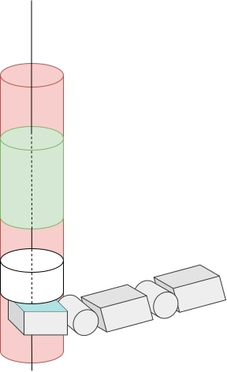

# Tasks

This folder contains the definition of several robotic tasks. In particular, `local_bm.py` implements the "one-finger", local-control task, *aka* the "local benchmark", and `global_bm.py` implements the "full-hand", global-control task, *aka* the "global benchmark".

## Local benchmark

The local benchmark consists of a simple task involving only one robotic finger. The latter is effort controlled, and interacts with a so-called "sliding button". The artificial agent controlling the robotic finger receives pressure data from sensors located on the fingertip. The goal for the agent is to lift the button by pressing with the finger so as to place it in the high-reward zone. 

We consider two ways of making the task a benchmark for assessing the adaptation capabilities of the artificial agent controlling the finger:
- The position and length of the high-reward zone can change from one episode to another.
- The physical properties of the button (stiffness,  damping, ...) can change from one episode to another.

  

## Global benchmark

The global benchmark consists of an adaptation of the Dactyl benchmark developed by OpenAI, in which the robotic hand has to orient a cubic block in the same way as a goal cube. 

The forked repository proposes 4 different types of observation, all of them considering "extrinsic"[^1] sensing:
- "`openai`": 
- "`full_no_vel`":
- "`full`":
- "`full_state`":
  
We add two more types that consider intrinsic[^1] sensing only:

  

[^1]:
